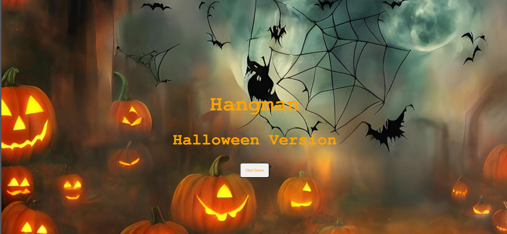

# Hangman Game

## Date: 1/26/2021

### By: Yousif Al Haddad

#### [Website](https://open-oatmeal.surge.sh/) | [GitHub](https://github.com/Yousifh93) | [LinkedIn](https://emea01.safelinks.protection.outlook.com/?url=https%3A%2F%2Fwww.linkedin.com%2Fin%2Fyousif-al-haddad-b32b562aa%3Futm_source%3Dshare%26utm_campaign%3Dshare_via%26utm_content%3Dprofile%26utm_medium%3Dios_app&data=05%7C02%7C%7Ca4409ecd32f24040d17508dde967f2c4%7C84df9e7fe9f640afb435aaaaaaaaaaaa%7C1%7C0%7C638923354851507744%7CUnknown%7CTWFpbGZsb3d8eyJFbXB0eU1hcGkiOnRydWUsIlYiOiIwLjAuMDAwMCIsIlAiOiJXaW4zMiIsIkFOIjoiTWFpbCIsIldUIjoyfQ%3D%3D%7C0%7C%7C%7C&sdata=AViVeYeMZ6uyN8n1kU%2Bzmqw1zGcSU6Odwx%2Fy0lO11xs%3D&reserved=0)
***

### ***Description***
#### Hangman is a game where the player needs to guess the word from the letters shown on the screen. players have a limited number of times to guess and choose the letters to finally guess what the actual word is. If the player manages to guess the correct word they win.
***

### ***Technologies Used***
* HTML
* CSS
* JavaScript
***

### ***Wireframe***

##### Homepage

##### Gamepage

***

### ***Credits***
Images:

- Pixbay site: https://pixabay.com/

1- Image: https://cdn.pixabay.com/photo/2022/09/21/10/27/pumpkins-7469995_1280.jpg

// the url of the image you got from
***
